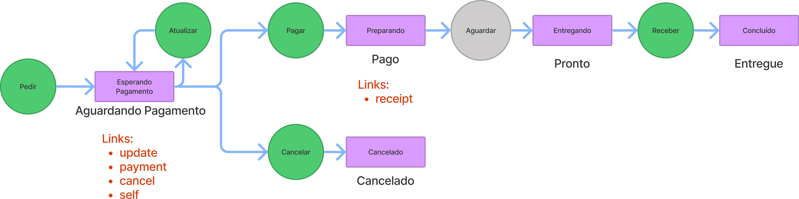

# Design de API com Django

Esse project é um exemploe de implementação dos níveis de maturidade 0-3
de uma API baseado no Django Quickstart do Henrique Bastos e nos 
seguintes esquemas:



<table>
    <thead>
        <tr>
            <th>Ação</th>
            <th>Verbo</th>
            <th>URL</th>
            <th>Lógica de negócio</th>
            <th>Status Code de sucesso</th>
            <th>Status Code de erro</th>
            <th>Hyperlinks</th>
        </tr>
    </thead>
    <tbody>
        <tr>
            <td>Pedir</td>
            <td>POST</td>
            <td>/order</td>
            <td>Cria um novo pedido</td>
            <td>201</td>
            <td>-</td>
            <td>self, update, cancel, payment</td>
        </tr>
        <tr>
            <td>Atualizar</td>
            <td>PUT</td>
            <td>/order/{id}</td>
            <td>Atualiza o pedido, se e somente se o status for "Aguardando Pagamento"</td>
            <td>200</td>
            <td>409</td>
            <td>self, update, cancel, payment</td>
        </tr>
        <tr>
            <td>Cancelar</td>
            <td>DELETE</td>
            <td>/order/{id}</td>
            <td>Atualiza o pedido para o status Cancelado, se e somente se o status for "Aguardando Pagamento"</td>
            <td>204</td>
            <td>409</td>
            <td>-</td>
        </tr>
        <tr>
            <td>Pagar</td>
            <td>PUT</td>
            <td>/payment/{id}</td>
            <td>Realiza o pagamento e no sucesso atualiza o status para Pago, se e somente se o status for "Aguardando Pagamento"</td>
            <td>200</td>
            <td>409,422</td>
            <td>self, receipt</td>
        </tr>
        <tr>
            <td>Aguardar</td>
            <td>-</td>
            <td>-</td>
            <td>Um funcionário prepara o pedido.</td>
            <td>-</td>
            <td>-</td>
            <td></td>
        </tr>
        <tr>
            <td>Receber</td>
            <td>DELETE</td>
            <td>/receipt/{id}</td>
            <td>Confirmar o recebimento atualizando o status para "Entregue", se e somente se o status for Pronto</td>
            <td>204</td>
            <td>409</td>
            <td>-</td>
        </tr>
        <tr>
            <td>-</td>
            <td>GET</td>
            <td>/order/{id}</td>
            <td>Retorna a última representação do recurso pedido.</td>
            <td>200</td>
            <td>-</td>
            <td>Depende do status</td>
        </tr>
    </tbody>
</table>


# Django Quickstart

The Django template for Heroku was forked from heriquebastos/django-quickstart

## Usage

Setup:

```
cd myproject
python -m venv .venv
source .venv/bin/activate
pip install -r requirements.txt
```

Deploy:

```
PRJ=myapp && \
git init && \
git add . && \
git commit -m 'Initial import' && \
heroku create $PRJ && \
heroku config:set DEBUG=True SECRET_KEY=`cat .env | grep SECRET_KEY | cut -d = -f 2` && \
git push heroku master
```